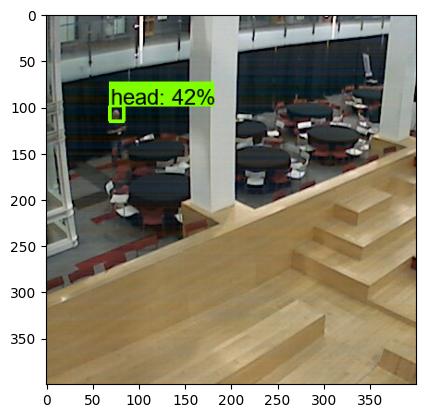
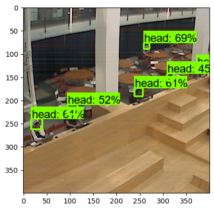
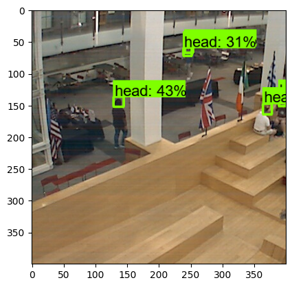
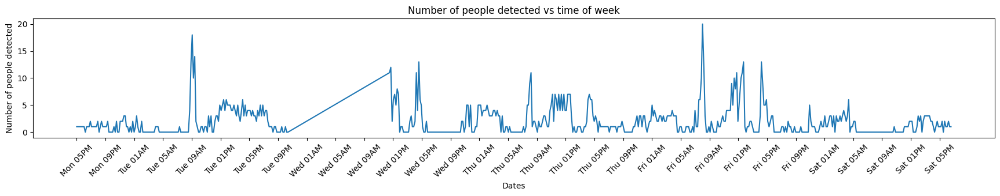
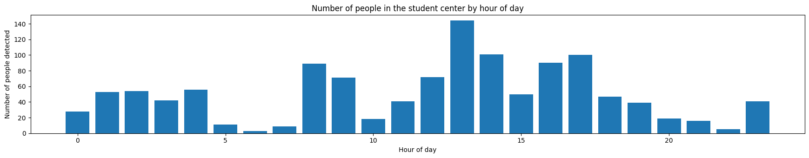
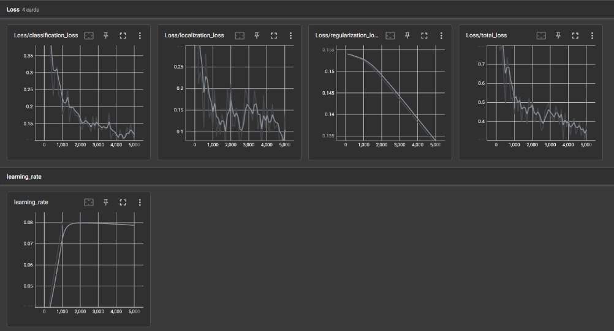

# About
  

Are you curious about when the Northeastern student center is the busiest? Well that is what I am to discover in this project. 
Using a public webcam in the student center ([see here for yourself](http://129.10.161.241/mjpg/video.mjpg)), I aim to capture a frame of what the webcam sees (see `./videoscraper.py`),
and then train an object detection model to count the number of heads. Interestingly, we have to train our own object detection model as the angle and quality of the
webcam is very different compared to other training datasets. For that reason, I trained the model to recognize the heads of people in the student center as often people are sitting or talking with others so their bodies are obscured, but their heads are not!

## Results
### Analysis Results
#### Detections by time of week

#### Detections by hour of the day

#### Interpretations
Here we can clearly see that the detections are highest during the weekdays, which makes sense since people often go to the student center after class. Additionally, there is often spikes around breakfast, lunch, and dinner time (ie 9am, 12pm, and 5pm) which makes sense since the student center has restaurants in it. It also could be due to the fact that summer class sections start/end around that time (this data was collected in the summer), so these peaks could change during fall and spring when the class schedule differs.

Interestingly, we can see there are some big peaks, such as Tuesday at 8am, which is when an event was happing at the student center! We can also see that from Tuesday at 9 PM to Wednesday at 9 AM there is weird, constantly increasing line, which is caused by data being missing there when my sister unplugged the raspberry pi I was using to capture the stream data! 

In all, from both theses plots we can tell that the least crowded times to go to the student center are the weekends, non-meal times, in the mornings before 8am, and at night after 8 PM.

Note: these result plots and the example detections above are generated in `./run_and_evaluate_detection.ipynb`.

### Detector Results

In training the model I was able to get a final loss of about .10, which I think is pretty good considering how highly compressed/pixelated the webcam data is and how the model was also only trained with about 50 images. I think one thing that really helped increase the model accuracy was training the model to detect heads, rather than a full person, as this lets it be more flexible in detecting people when the student center is super busy or when people are sitting and the only thing the webcam sees is their heads. Additionally, another cool thing I found when training the model was the importance of including images with no people in it during the training in addition to those with people. During my first trains of the model, I didn't include such images, and the models ended up with a lot of false positives at night (when there are no people in the student center), but including fully representative data was super useful to improving the accuracy of the model.

## Future Considerations
This is very much as introductory glance at the power of using this data processing pipeline and model. I only captured about a weeks worth of images, so this is by no means an encompassing picture. So, in the future I think it would be cool to gather data for all 4 semesters (spring, fall, summer 1, and summer 2) to compare the crowdedness of the student center. Additionally, I think it would then be really cool to train an RNN to then predict the crowdedness for a given day and time, since that would let us know if there will be seats at the student center without even having to go! Also, the object detection model was only trained on about 50 labelled images, so increasing the training/test data would also probably create a better model.

## How to run the webcam scraper
1. Create a virtual environment
2. Run `pip install -r scraper_requirements.txt` to install the requirement for the image scraper
3. Run `python videoscraper.py 10 days=7`
    - The first argument (`10`) in this example is the number of minutes between each capture
    - The second argument (`days=7`) is the duration of time to run the scraper for
    - NOTE: I recommend running this on a raspberry pi of some sort as it requires little processing power and needs to be running 24/7 since you are capturing real time data

## How to train and evaluate the model yourself
0. Setup your environment following the instructions here: https://tensorflow-object-detection-api-tutorial.readthedocs.io/en/latest/install.html. I used the mobile net model as it is a good mix of speed and accuracy, but you might want to explore with different models.
1. Train and label data in the TensorFlow/workspace/head_counter/images test and train directories (I used the `labelImg` library and labeled the heads in the image)
2. make labels
    - run `python TensorFlow\scripts\preprocessing\generate_tfrecord.py -x TensorFlow\workspace\head_detector\images\train -l TensorFlow\workspace\head_detector\annotations\label_map.pbtxt -o TensorFlow\workspace\head_detector\annotations\train.record`
    - run `python TensorFlow\scripts\preprocessing\generate_tfrecord.py -x TensorFlow\workspace\head_detector\images\test -l TensorFlow\workspace\head_detector\annotations\label_map.pbtxt -o TensorFlow\workspace\head_detector\annotations\test.record`
    - I only used 1 label, `head`, so if you make multiple labels you will have to update the pipeline config to reflect that
3. cd into the `TensorFlow\workspace\head_detector` folder
3. train the model `python model_main_tf2.py --model_dir=models\ssd_mobilenet_v2_fpnlite_320 --pipeline_config_path=models\ssd_mobilenet_v2_fpnlite_320\pipeline.config`
4. export the model `python exporter_main_v2.py --input_type image_tensor --pipeline_config_path models\ssd_mobilenet_v2_fpnlite_320\pipeline.config --trained_checkpoint_dir models\ssd_mobilenet_v2_fpnlite_320 --output_directory exported-models\head_detector`
5. run `test_with_exported.ipynb` which will load the model, detect heads in all image in the `frames` directory, and plot the detected results

Alternatively, you can skip steps 0-4 and just use the model located at `TensorFlow\workspace\head_detector\exported-models\head_detector\saved_model`, which is the export of the model I trained myself

Note: I found that running the `./crop.ipynb` notebook is useful before labeling data as the raw screenshot taken by the video scraper include very pixelated heads in the distance which may confuse the detector. Although we are only looking at a smaller subset of the image, we can still analyze the overall busyness of the student center by comparing the relative amount of people in the images.
